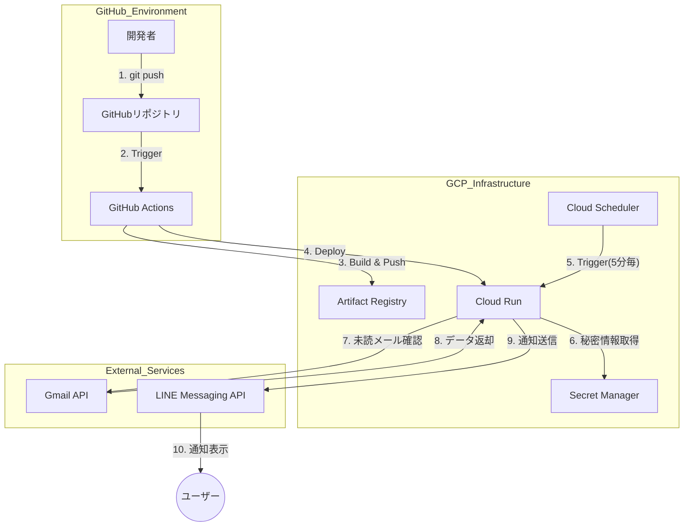

# GMailToLine プロジェクト 要件定義書

**作成日**: 2025-12-24
**バージョン**: 1.0

---

## 1. プロジェクト概要

### 1.1 目的
Gmail APIを使用して未読メールを定期的に取得し、LINE Messaging APIを通じてユーザーに通知を送信するシステムを構築する。

### 1.2 背景
- Gmailの未読メールをリアルタイムに近い形で把握したい
- LINEを通じて手軽に通知を受け取りたい
- インフラをコード管理し、CI/CDパイプラインで自動デプロイを実現したい

### 1.3 プロジェクトスコープ

**対象範囲**:
- Gmail未読メール取得機能
- LINE通知送信機能
- GCP上でのサーバーレス実行環境構築
- Terraformによるインフラ管理
- GitHub Actionsによる自動デプロイ

**対象外**:
- メールの既読管理
- 双方向のチャット機能
- メール本文の全文表示
- 複数ユーザー管理

---

## 2. システムアーキテクチャ

### 2.1 全体構成図



### 2.2 技術スタック

| カテゴリ | 技術 | 用途 |
|---------|------|------|
| **プログラミング言語** | Python 3.11+ | アプリケーションロジック |
| **クラウド** | Google Cloud Platform | インフラ基盤 |
| **IaC** | Terraform | インフラコード管理 |
| **CI/CD** | GitHub Actions | 自動デプロイパイプライン |
| **コンテナ** | Docker | アプリケーションコンテナ化 |
| **バージョン管理** | Git/GitHub | ソースコード管理 |

### 2.3 GCPサービス構成

| サービス | 役割 | 用途 |
|---------|------|------|
| **Cloud Run** | サーバーレス実行環境 | Pythonアプリケーションの実行 |
| **Cloud Scheduler** | 定期実行トリガー | 5分毎にCloud Runを起動 |
| **Artifact Registry** | コンテナレジストリ | Dockerイメージの保存 |
| **Secret Manager** | 秘密情報管理 | API Key、トークンの安全な保管 |

---

## 3. 機能要件

### 3.1 Gmail未読メール取得機能

**FR-001: Gmail API連携**
- Gmail APIを使用してユーザーのメールボックスにアクセス
- OAuth 2.0認証を使用した安全な認証
- 未読メールのみを取得

**FR-002: メール情報の抽出**
- 取得する情報:
  - 送信者（From）
  - 件名（Subject）
  - 受信日時
  - メールID
- 未読メールの件数カウント

**FR-003: エラーハンドリング**
- Gmail API接続エラー時の適切な処理
- レート制限への対応
- タイムアウト処理

### 3.2 LINE通知機能

**FR-004: LINE Messaging API連携**
- LINE Messaging APIを使用した通知送信
- アクセストークンによる認証

**FR-005: 通知メッセージフォーマット**
- 未読メール情報を整形してLINEに送信
- メッセージ形式:
  ```
  📧 Gmail未読通知

  未読メール: X件

  最新メール:
  📨 送信者
  件名: XXXXXXX
  日時: YYYY-MM-DD HH:MM
  ```

**FR-006: 通知制御**
- 未読メールが0件の場合は通知しない（オプション）
- 送信エラー時のリトライロジック

### 3.3 定期実行機能

**FR-007: スケジュール実行**
- Cloud Schedulerによる5分間隔での実行
- タイムゾーン: Asia/Tokyo
- HTTPトリガーによるCloud Run起動

### 3.4 セキュリティ機能

**FR-008: 秘密情報の安全な管理**
- Secret Managerでの以下の情報管理:
  - Gmail OAuth認証情報
  - LINE Channel Access Token
  - その他API Key
- アプリケーション起動時に動的に取得

**FR-009: 認証・認可**
- Cloud Run実行用のService Account設定
- 必要最小限の権限付与（Principle of Least Privilege）

---

## 4. 非機能要件

### 4.1 パフォーマンス要件

**NFR-001: レスポンス時間**
- Cloud Run起動からLINE通知送信完了まで: 30秒以内
- Gmail API応答時間: 10秒以内

**NFR-002: 同時実行**
- 同時実行数: 1（Cloud Scheduler制御により重複実行なし）

### 4.2 可用性要件

**NFR-003: サービス稼働率**
- 目標稼働率: 99.0%以上（Cloud Runの標準SLA）
- Cloud Schedulerの実行成功率: 95%以上

**NFR-004: エラー回復**
- 一時的な障害時の自動リトライ
- 次回実行時の自動復旧

### 4.3 スケーラビリティ要件

**NFR-005: 拡張性**
- Cloud Runの自動スケーリング対応
- メール量増加に対する対応可能な設計

### 4.4 セキュリティ要件

**NFR-006: データ保護**
- 通信は全てHTTPS/TLS 1.2以上
- 秘密情報はSecret Managerで暗号化保存
- コンテナイメージのプライベート管理

**NFR-007: アクセス制御**
- GCP Service Accountによる認証
- 最小権限の原則に基づく権限設定

### 4.5 運用要件

**NFR-008: ログ管理**
- Cloud Loggingへのログ出力
- エラーログの記録
- 実行履歴の追跡可能性

**NFR-009: モニタリング**
- Cloud Monitoringでの監視
- 実行成功/失敗の把握

### 4.6 保守性要件

**NFR-010: コード管理**
- Gitによるバージョン管理
- 意味のあるコミットメッセージ
- ブランチ戦略の遵守（main/dev）

**NFR-011: インフラコード化**
- Terraformによる完全なIaC管理
- 変更履歴の追跡可能性
- 環境の再現性確保

---

## 5. インフラ要件

### 5.1 ディレクトリ構成

```
~/GmailToLine/                  # プロジェクトルート
├── .github/
│   └── workflows/
│       └── deploy.yml          # GitHub Actions設定
├── app/                        # アプリケーションコード
│   ├── main.py                 # メインスクリプト
│   ├── requirements.txt        # Python依存関係
│   └── Dockerfile              # コンテナ定義
├── terraform/                  # インフラコード
│   ├── main.tf                 # メインTerraform設定
│   ├── variables.tf            # 変数定義
│   ├── outputs.tf              # 出力定義
│   ├── backend.tf              # State管理設定
│   └── terraform.tfvars        # 変数値（.gitignore）
├── .gitignore                  # Git除外設定
└── README.md                   # プロジェクト説明
```

### 5.2 Terraform管理対象リソース

**INF-001: Artifact Registry**
- リポジトリ名: `gmail-line-repo`
- リージョン: `asia-northeast1`
- フォーマット: Docker

**INF-002: Cloud Run**
- サービス名: `gmail-line-app`
- リージョン: `asia-northeast1`
- 最小インスタンス: 0
- 最大インスタンス: 1
- メモリ: 256Mi
- CPU: 1
- タイムアウト: 60秒
- 実行環境: Python 3.11+

**INF-003: Cloud Scheduler**
- ジョブ名: `gmail-line-scheduler`
- スケジュール: `*/5 * * * *` (5分毎)
- タイムゾーン: `Asia/Tokyo`
- ターゲット: Cloud Run HTTPエンドポイント

**INF-004: Secret Manager**
- Secrets:
  - `gmail-credentials`
  - `line-channel-access-token`
- バージョニング: 有効

**INF-005: Service Account**
- Cloud Run実行用SA
  - 権限:
    - `secretmanager.secretAccessor`
    - `logging.logWriter`
- GitHub Actions用SA
  - 権限:
    - `artifactregistry.writer`
    - `run.admin`
    - `iam.serviceAccountUser`

**INF-006: IAM設定**
- Cloud Schedulerに対するCloud Run Invoker権限
- Service Account間の権限委譲設定

### 5.3 Terraform State管理

**INF-007: State Backend**
- GCS Bucketでのリモートstate管理（推奨）
- または、ローカルstate（初期段階）
- State lock機能の有効化

### 5.4 環境変数管理

**INF-008: Cloud Run環境変数**
- `PROJECT_ID`: GCPプロジェクトID
- `SECRET_NAME_GMAIL`: Gmail認証情報のSecret名
- `SECRET_NAME_LINE`: LINEトークンのSecret名

---

## 6. CI/CD要件

### 6.1 GitHub Actions ワークフロー

**CI-001: トリガー条件**
- ブランチ: `main`
- 対象パス:
  - `app/**`
  - `.github/workflows/**`
- イベント: `push`

**CI-002: ビルドプロセス**
1. コードチェックアウト
2. GCP認証（Service Accountキー使用）
3. Docker認証設定
4. Dockerイメージビルド
5. Artifact Registryへのプッシュ
6. Cloud Runへのデプロイ

**CI-003: イメージタグ戦略**
- タグ: `${{ github.sha }}`（コミットハッシュ）
- latest タグの併用（オプション）

**CI-004: デプロイ検証**
- デプロイ成功/失敗のステータス確認
- エラー時の通知（GitHub Actionsログ）

### 6.2 GitHub Secrets管理

**CI-005: 必要なSecrets**
- `GCP_SA_KEY`: GitHub Actions用Service AccountのJSONキー
- `GCP_PROJECT_ID`: GCPプロジェクトID
- `GCP_REGION`: デプロイリージョン（asia-northeast1）

### 6.3 ブランチ戦略

**CI-006: ブランチ構成**
```
main                     # 本番環境（Cloud Runにデプロイ）
├── dev                  # 開発ブランチ
│   ├── feature/xxx      # 機能開発
│   └── fix/xxx          # バグ修正
└── terraform            # インフラ変更
```

**CI-007: マージルール**
- `main`へのマージ前にレビュー（推奨）
- テスト実行（将来的に追加）

---

## 7. セキュリティ要件詳細

### 7.1 認証情報管理

**SEC-001: Gmail OAuth 2.0**
- 認証フロー: サービスアカウントまたはOAuth 2.0
- スコープ: `https://www.googleapis.com/auth/gmail.readonly`
- 認証情報の保存: Secret Manager

**SEC-002: LINE Messaging API**
- Channel Access Token: Secret Manager保存
- トークンのローテーション計画

### 7.2 アクセス制御

**SEC-003: Cloud Run**
- 認証: `--no-allow-unauthenticated`
- 呼び出し元: Cloud Scheduler Service Account のみ

**SEC-004: Secret Manager**
- アクセス権限: Cloud Run Service Account のみ
- バージョン管理: 有効

### 7.3 ネットワークセキュリティ

**SEC-005: 通信暗号化**
- 全ての外部API通信: HTTPS
- GCP内部通信: Google Front End経由

### 7.4 Git管理からの除外

**SEC-006: .gitignore設定**
```
.DS_Store
__pycache__/
*.pyc
.env
*.tfstate
*.tfstate.backup
.terraform/
terraform.tfvars
credentials.json
token.json
*.pem
*.key
```

---

## 8. 開発・デプロイフロー

### 8.1 初回セットアップ（Terraform実行）

**FLOW-001: ローカルからのTerraform実行**
1. GCP認証設定
   ```bash
   gcloud auth application-default login
   ```
2. Terraform初期化
   ```bash
   cd terraform
   terraform init
   ```
3. プラン確認
   ```bash
   terraform plan
   ```
4. リソース作成
   ```bash
   terraform apply
   ```

### 8.2 日常的な開発フロー

**FLOW-002: コード変更とデプロイ**
1. ローカルで開発
   ```bash
   cd app
   # main.py を編集
   ```
2. ローカルテスト（オプション）
   ```bash
   docker build -t test-image .
   docker run test-image
   ```
3. Git コミット＆プッシュ
   ```bash
   git add .
   git commit -m "feat: メッセージフォーマットを改善"
   git push origin main
   ```
4. GitHub Actions自動実行
   - ビルド → プッシュ → デプロイ
   - GitHubの「Actions」タブで確認

### 8.3 インフラ変更フロー

**FLOW-003: Terraformコード変更**
1. `terraform/` 内のファイルを編集
2. ローカルでプラン確認
   ```bash
   terraform plan
   ```
3. 変更適用
   ```bash
   terraform apply
   ```
4. Git コミット
   ```bash
   git add terraform/
   git commit -m "infra: Cloud Runのメモリを512Miに変更"
   git push
   ```

---

## 9. テスト要件

### 9.1 単体テスト

**TEST-001: 関数レベルのテスト**
- Gmail API接続のモックテスト
- LINE API送信のモックテスト
- メッセージフォーマット関数のテスト

### 9.2 結合テスト

**TEST-002: エンドツーエンドテスト**
- ローカル環境でのDocker実行テスト
- 手動でのCloud Run実行テスト

### 9.3 インフラテスト

**TEST-003: Terraformテスト**
- `terraform plan`での構文チェック
- `terraform validate`での検証

---

## 10. 運用要件

### 10.1 監視項目

**OPS-001: Cloud Runモニタリング**
- 実行回数
- エラー率
- レスポンスタイム
- メモリ使用量

**OPS-002: Cloud Schedulerモニタリング**
- ジョブ実行成功率
- 失敗回数

### 10.2 ログ管理

**OPS-003: ログ出力**
- アプリケーションログ: Cloud Logging
- ログレベル: INFO, WARNING, ERROR
- 構造化ログ形式（JSON）推奨

### 10.3 障害対応

**OPS-004: エラー時の対応**
1. Cloud Loggingでエラー確認
2. Cloud Runのログ詳細確認
3. 必要に応じてロールバック
   ```bash
   gcloud run services update-traffic gmail-line-app --to-revisions=PREVIOUS_REVISION=100
   ```

### 10.4 コスト管理

**OPS-005: 予想コスト**
- Cloud Run: 月額 $1-5（実行時間による）
- Cloud Scheduler: 月額 $0.10
- Artifact Registry: 月額 $0.50以下
- Secret Manager: 月額 $1以下
- **合計見込み**: 月額 $5-10

---

## 11. 制約事項

### 11.1 技術的制約

**CONST-001: API制限**
- Gmail API: 1ユーザーあたり 250クォータユニット/秒
- LINE Messaging API: レート制限あり（プランによる）

**CONST-002: Cloud Run制限**
- 最大タイムアウト: 60秒
- リクエストサイズ: 最大32MB
- コールドスタート: 初回実行時に遅延あり

### 11.2 運用制約

**CONST-003: 単一ユーザー**
- 本システムは単一ユーザー向け設計
- マルチテナント対応は範囲外

**CONST-004: メール取得範囲**
- 未読メールのみ対象
- 取得件数上限: 10件（設定可能）

---

## 12. マイルストーン

### Phase 1: 基盤構築（完了予定: Week 1-2）
- [x] GitHubリポジトリ作成
- [ ] Terraformコード作成
- [ ] GCPリソース初期構築
- [ ] GitHub Actions設定

### Phase 2: アプリケーション開発（完了予定: Week 3-4）
- [ ] Gmail API連携実装
- [ ] LINE API連携実装
- [ ] Dockerコンテナ化
- [ ] 初回デプロイ

### Phase 3: テスト・調整（完了予定: Week 5）
- [ ] 結合テスト
- [ ] エラーハンドリング改善
- [ ] ログ・モニタリング設定

### Phase 4: 本番運用開始（Week 6）
- [ ] 本番環境での動作確認
- [ ] ドキュメント整備
- [ ] 運用開始

---

## 13. 参考資料

### 13.1 外部ドキュメント
- [Gmail API Documentation](https://developers.google.com/gmail/api)
- [LINE Messaging API Documentation](https://developers.line.biz/ja/docs/messaging-api/)
- [Terraform GCP Provider](https://registry.terraform.io/providers/hashicorp/google/latest/docs)
- [Cloud Run Documentation](https://cloud.google.com/run/docs)
- [GitHub Actions Documentation](https://docs.github.com/actions)

### 13.2 内部ドキュメント
- [Githubとの連携も交えて.md](Githubとの連携も交えて%202b077f6b581080beae3ef0fef9880e53.md)
- README.md（プロジェクト概要）

---

## 14. 変更履歴

| バージョン | 日付 | 変更内容 | 作成者 |
|----------|------|---------|--------|
| 1.0 | 2025-12-24 | 初版作成 | - |

---

## 15. 承認

| 役割 | 氏名 | 承認日 | 署名 |
|-----|------|--------|------|
| プロジェクトオーナー | - | - | - |
| 技術リード | - | - | - |

---

**Document End**
